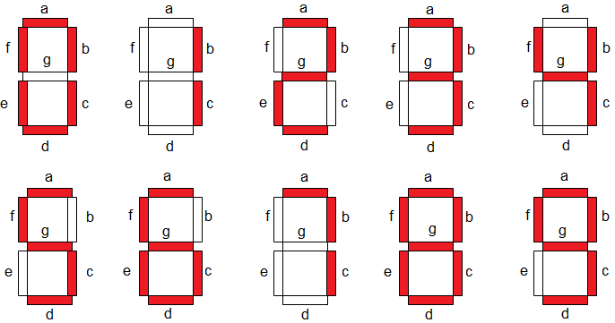

# Relógio Sincrônico

Instruções para montagem do trabalho de arte "Relógio Sincrônico" da artista Isadora Maia, que esteve na exposição "Mesmo Estando Separados" com a curadoria de Bruna Fernanda, Caio Bonifácio, Érica Burini, Glauce Santos e Lucas Goulart, no Ateliê 397, que fica na Rua Cruzeiro, 802, Barra Funda. 

## Materiais

- Arduino UNO R3 ATMEGA328p
- Módulo Real Time Clock DS3231
- Bateria de Lítio Recarregável LI2032 3,6V
- 5 mini protoboards 170 furos
- Jumpers (macho-macho e macho-fêmea)
- Fonte 5V para Arduino
- 5m fita de LEDs WS2811 
- Ferro de solda e estanho 
- Fonte 12V para fita de LEDs
- Caixa de MDF (32x22x5 cm)
- Tinta Spray preto fosco
- Impressão 3D - 28 Difusores para Segmentos
- Impressão 3D - 2 Difusores para Pontos
- Impressão 3D - Traseira
- Impressão 3D - Frente
- Folha de Acetato A3 30x42 cm
- Velcro
- 2 mão francesa 
- Extensão Tripolar de 5m branca 

## Descrição

O trabalho de montagem consistiu em obter uma solução para montar um relógio que exibe a mesma informação ha hora no minuto.
Para concretizar esse relógio, foi usado um Arduino conectado ao módulo RTC para obter a hora, mapear cada dígito em um buffer do tamanho da fita de led que ilumine apenas os trechos que representem o número.
Para exibir os dígitos, foi usado um molde de impressão 3D que forme o desenho do display de 7 segmentos.
A caixa de MDF pintada com tinta spray encapsulou os demais materiais, em especial para esconder os jumpers, protoboard e mostrar as peças feitas por impressão 3D com a fita LED no interior. A folha de acetato e o velcro evitam que as peças internas tenham contato com a parede e, por fim, a mão francesa garante apoio na parede para pendurar.

## Mapeamento dos dígitos 

|     |    0   |   1   |   2   |   3   |   4  |   5   |    6   |   7  |    8    |    9   |
|-----|:------:|:-----:|:-----:|:-----:|:----:|:-----:|:------:|:----:|:-------:|:------:|
|  ON | ABCDEF |   BC  | ABDEG | ABCDG | BCFG | ACDFG | ACDEFG |  ABC | ABCDEFG | ABCDFG |
| OFF |    G   | ADEFG |   CF  |   EF  |  ADE |   BE  |    B   | DEFG |         |    E   |
