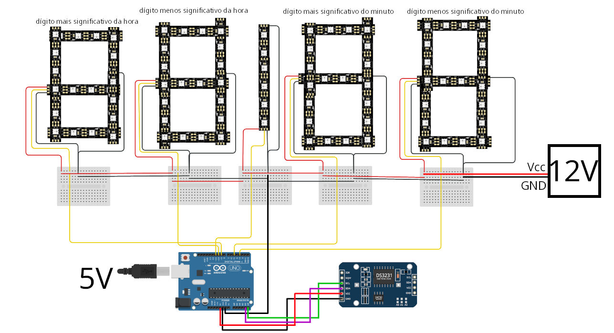
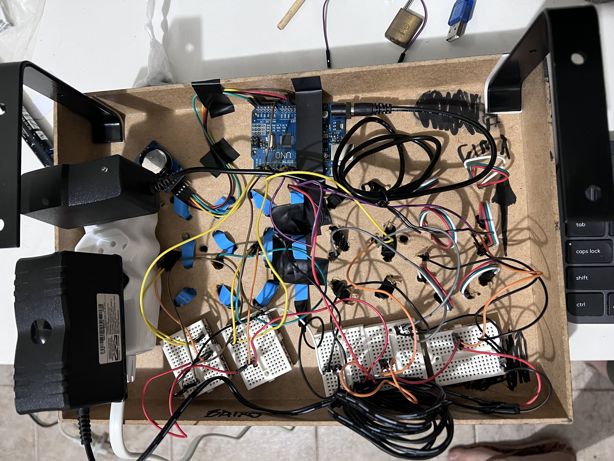
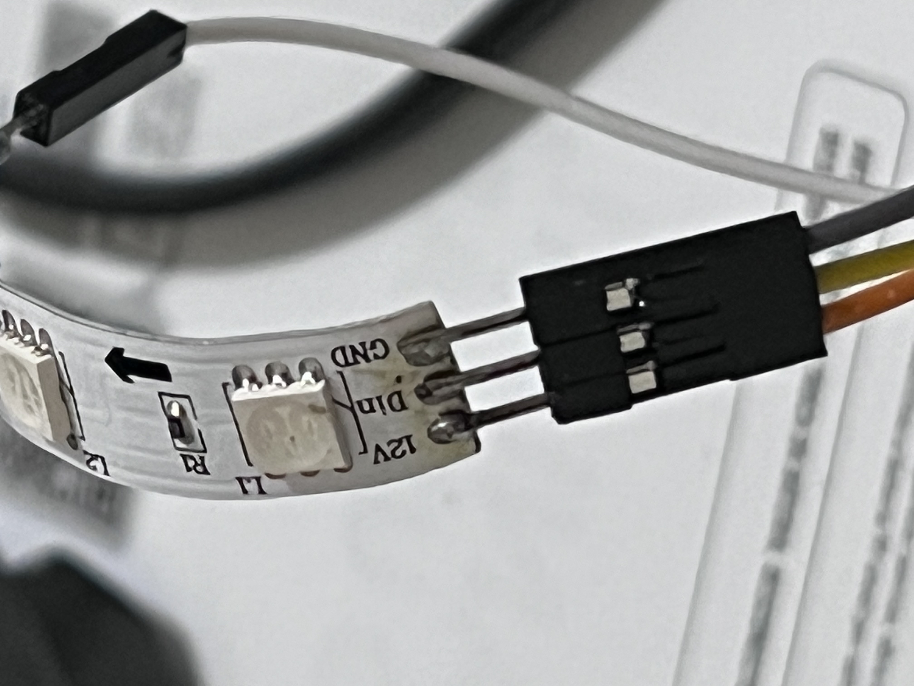
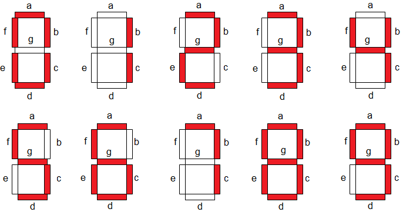
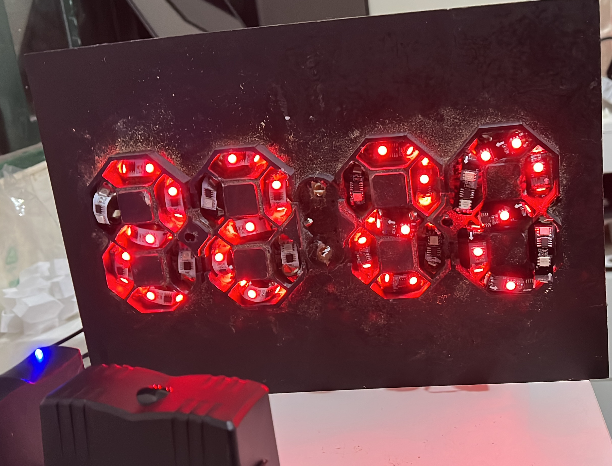
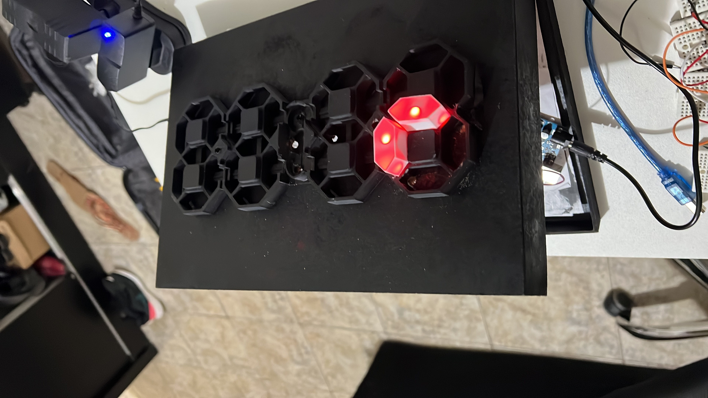

# Circuito 

## RTC 

Foi utilizado o módulo DS3231, com a biblioteca [RTClib](https://adafruit.github.io/RTClib/html/class_r_t_c___d_s3231.html)

| Pino Arduino | Pino RTC |
|:------------:|:--------:|
|      A5      |    SCL   |
|      A4      |    SDA   |
|      5V      |    VCC   |
|      GND     |    GND   |

*Atenção:* Foi utilizado 5V devido a bateria recarregável LI2032 3,6V. Se utilizar uma bateria CR2032 conecte em 3V!

OBS.: A bateria recarregável pode demorar até 2 dias para carregar o suficiente para salvar o dado da data/hora!

## Fita LED

Para conectar as fitas de LED ao Arduino, foi necessário soldar jumpers machos na emenda que garante contato. 

### Mapeamento dos dígitos 

|     |    0   |   1   |   2   |   3   |   4  |   5   |    6   |   7  |    8    |    9   |
|-----|:------:|:-----:|:-----:|:-----:|:----:|:-----:|:------:|:----:|:-------:|:------:|
|  ON | ABCDEF |   BC  | ABDEG | ABCDG | BCFG | ACDFG | ACDEFG |  ABC | ABCDEFG | ABCDFG |
| OFF |    G   | ADEFG |   CF  |   EF  |  ADE |   BE  |    B   | DEFG |         |    E   |

No nosso caso, cada segmento possui a menor unidade da fita, que são 3 LEDs em sequência.

*Atenção:* Se o segmento utilizado for muito grande, é possível que seja necessário um circuito auxiliar para que a corrente que chega aos pinos do Arduino seja compatível. Segundo o [datasheet](https://html.alldatasheet.com/html-pdf/1132633/WORLDSEMI/WS2811/2853/5/WS2811.html), cada LED irá puxar 18.5mA, no caso, 3 por segmento, em 7 segmentos: 21 LEDs, então, 388.5mA

# Bilioteca

Para controlar os leds, foi utilizada a biblioteca [FastLED](https://github.com/FastLED/FastLED/wiki/Basic-usage)

| Pino Arduino |            Fita LED            |
|:------------:|:------------------------------:|
|       9      |   Din Mais Significativo Hora  |
|      10      |  Din Menos Significativo Hora  |
|      11      |           Dois Pontos          |
|       5      |  Din Mais Significativo Minuto |
|       3      | Din Menos Significativo Minuto |

